# Arquitectura de Contexto: Inyección y Evaluación de Reglas Condicionales

Este documento explica cómo funciona el flujo de inyección de reglas, la evaluación de triggers y el manejo del contexto (tokens) entre el IDE y el CLI de Antigravity.

---

## 1. El Problema de Diseño: Token Economy vs. Context Loss

Si el sistema inyectara todas las reglas condicionales (ej. `sdd-orchestrator.md`, `secops.md`, etc.) directamente en el **System Prompt** en cada interacción:
* **Desventaja:** Se consumirían miles de tokens innecesarios por mensaje.
* **Resultado:** La cuota de la API se agotaría rápidamente y la ventana de contexto se llenaría con reglas inútiles para tareas simples.

Para solucionar esto, el sistema utiliza un modelo híbrido de **Evaluación Dinámica de Triggers**.

---

## 2. Flujo de Ejecución por Turno (Mensaje a Mensaje)

El ciclo de vida de una regla condicional sigue este flujo en cada mensaje que el usuario envía:

```mermaid
sequenceDiagram
    participant U as Usuario
    participant S as System Prompt (IDE/CLI)
    participant M as Agent (Model)
    participant FS as Filesystem

    U->>M: Envía mensaje: "Vamos a iniciar una feature nueva..."
    Note over S: El sistema inyecta la lista de triggers<br/>(descripción y rutas, no el contenido)
    S-->>M: Entrega System Prompt + Historial
    Note over M: El agente evalúa si el mensaje<br/>hace match con algún trigger
    rect rgb(30, 40, 50)
        Note over M: Trigger "feature nueva" -> Requiere sdd-orchestrator.md
        M->>FS: Llama a view_file (sdd-orchestrator.md)
        FS-->>M: Retorna el contenido de las reglas
    end
    Note over M: Las reglas se cargan en la<br/>Memoria a Corto Plazo (Historial)
    M->>U: Responde con el plan de orquestación
```

### Detalle de los Componentes:

1. **System Prompt Constante (Reglas Globales):**
   * Contiene la personalidad, reglas absolutas (`pnpm`, estilo de commits) y una **tabla de mapeo de triggers**.
   * Esta tabla le dice al modelo: *"Si el usuario habla de X, debes ir a leer el archivo Y"*.

2. **Evaluación de Triggers (En cada turno):**
   * El trigger no es de un solo uso. Se evalúa en **cada mensaje**.
   * Si a mitad de una conversación larga el usuario introduce un tema que activa un trigger, el modelo detecta la condición nuevamente.

3. **Lectura Activa (`view_file`):**
   * El modelo lee el archivo correspondiente (`sdd-orchestrator.md`) únicamente cuando el trigger se activa.
   * Al leerlo, el contenido se incorpora al **Historial de la Conversación (Memoria a Corto Plazo)**.

---

## 3. Impacto del "Lost in the Middle" y Truncado de Tokens

Dado que el contenido del archivo de reglas condicionales entra al historial de conversación y no al System Prompt permanente:

> [!WARNING]
> Si la conversación se vuelve extremadamente larga o se comparten logs/código masivo, el contenido de la regla leída puede ser desplazado (truncado) de la ventana de contexto activa del modelo.

### Mecanismo de Recuperación:
Si el contexto se limpia/trunca y el usuario vuelve a mencionar palabras clave del trigger en turnos posteriores:
1. El modelo detecta que debe aplicar la regla.
2. Al buscar en su memoria reciente ve que ya no la tiene fresca.
3. El modelo toma la decisión de **volver a ejecutar `view_file`** para refrescar la memoria a corto plazo.

---

## 4. Comparativa: CLI vs. IDE

| Característica | IDE (VS Code / Cursor / etc.) | CLI (`antigravity-cli`) |
| :--- | :--- | :--- |
| **Mapeo de Triggers** | Inyectado en el System Prompt base en cada mensaje. | Inyectado en el System Prompt base en cada mensaje. |
| **Carga de Reglas** | Bajo demanda mediante triggers de sistema y `view_file`. | Bajo demanda mediante triggers de sistema y `view_file`. |
| **Persistencia** | Ligada a la sesión del chat actual. | Ligada al hilo de la conversación activa (`conversation_id`). |
| **Consumo de Tokens** | Optimizado. Solo consume tokens del archivo cuando el trigger está activo. | Optimizado. Solo consume tokens del archivo cuando el trigger está activo. |
