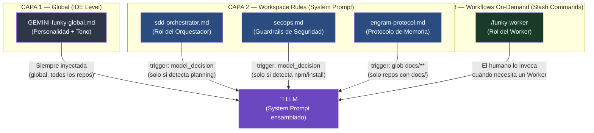

# Arquitectura de Configuración de Agentes — Funky AI

> **Propósito:** Guía conceptual definitiva de la arquitectura de 3 Capas. Explica qué archivo de configuración existe, en qué capa vive, cómo el IDE lo inyecta y por qué se tomó cada decisión de diseño.
> **Última actualización:** v2.0.1

---

## El Problema que Resuelve Esta Arquitectura

Un LLM tiene dos tipos de memoria:
- **System Prompt (Capa Estática):** Tokens que el IDE inyecta antes de la primera respuesta del usuario. El modelo los "ve" en cada turno de conversación, sin importar cuán larga sea la sesión. Es la memoria a largo plazo.
- **Conversational History (Capa Dinámica):** El historial acumulado de mensajes entre el humano y el modelo. Sufre de *Positional Bias*: los tokens más viejos pesan menos que los recientes. En sesiones largas, el modelo "olvida" lo que estaba al principio.

**Context Fading** es el fenómeno donde instrucciones clave (roles, protocolos, guardrails) se diluyen porque viven en el historial conversacional en lugar del System Prompt.

La arquitectura de 3 Capas de Funky AI resuelve esto asignando cada archivo de configuración a la capa correcta según su **permanencia requerida**.

---

## Las 3 Capas



---

## Inventario de Archivos de Configuración

| Archivo | Capa | Trigger | Propósito | Dónde vive |
|---------|------|---------|-----------|------------|
| `GEMINI-funky-global.md` | 1 — Global | Siempre (todos los repos) | Personalidad, tono, reglas de conducta base del Agente | `docs/prompts/` (backup)<br/>IDE Global Settings |
| `sdd-orchestrator.md` | 2 — Workspace Rule | `model_decision` (contextos de planificación) | Rol del Orquestador: Bootstrap, Escalation Matrix, Planning Checklist, Delegación | `.agents/rules/` |
| `secops.md` | 2 — Workspace Rule | `model_decision` (contextos de npm/install) | Auditoría de seguridad en instalaciones de dependencias | `.agents/rules/` |
| `engram-protocol.md` | 2 — Workspace Rule | `glob: docs/**` (repos con docs/) | Schema de escritura del Engram, Self-Check post-tarea, Return Envelope del Worker | `.agents/rules/` |
| `funky-worker` | 3 — Workflow | Slash Command `/funky-worker` | Rol del Worker: Bootstrap, Reglas de Ejecución, Return Envelope | `.agents/workflows/` |

---

## Asimetría Operativa: Orquestador vs. Worker

Esta es la decisión de diseño más crítica de v2.0.0/v2.0.1:

| Dimensión | Orquestador | Worker |
|-----------|-------------|--------|
| **Capa** | 2 (Workspace Rule) | 3 (Workflow On-Demand) |
| **Inyección** | IDE la inyecta silenciosamente al System Prompt | El humano la activa explícitamente con `/funky-worker` |
| **Duración de sesión** | Larga (múltiples iteraciones de SDD) | Corta (1 fase atómica) |
| **Riesgo de Context Fading** | ❌ Nulo (vive en System Prompt) | ✅ Aceptable (sesión corta, no hay suficiente historial para diluirse) |
| **Rol** | Planifica. Genera artefactos. Delega. | Ejecuta. Escribe al disco. Reporta. |

> **Regla de Oro:** Si una instrucción necesita sobrevivir una sesión larga → va en Capa 2. Si solo necesita guiar una ejecución atómica → Capa 3.

---

## Mecanismos de Trigger del IDE

### `trigger: model_decision`
El IDE (Antigravity) analiza el primer mensaje del usuario y decide si inyectar la regla en el System Prompt **antes** de enviar la petición al LLM. La regla llega al modelo como parte del System Prompt, no como un mensaje del historial.

**Ventaja:** El LLM nunca "olvida" la regla, sin importar cuán largo sea el historial de la sesión.

**Casos de uso:** Roles de larga duración (Orquestador), guardrails de seguridad condicionales (SecOps).

### `trigger: glob`
El IDE inyecta la regla cuando el workspace del usuario contiene archivos que matchean el patrón glob especificado.

```yaml
trigger: glob
globs: ["docs/*", "docs/**/*"]
```

**Casos de uso:** Protocolos que solo aplican en ciertos tipos de repositorios (ej. el Engram Protocol solo aplica en repos con documentación activa).

### Slash Commands (Capa 3)
El usuario invoca manualmente el workflow tipando `/funky-worker`. El contenido del workflow se inyecta en la conversación como un mensaje del sistema. Por ser sesiones cortas (1 fase atómica), el Context Fading no es un problema real.

**Por qué el Orquestador NO usa este mecanismo:** Una sesión de planificación puede durar decenas de turnos. Si el rol se inyecta vía Slash Command (historial), sufriría Context Fading a los 20 mensajes. Por eso vive en Capa 2.

---

## Flujo de Inicialización de un Proyecto Nuevo

Cuando el usuario corre `funky init`, el CLI copia los templates base a las rutas correctas:

```
funky init
    └── Copia templates base desde funky-cli/src/templates/bootstrap/
        ├── .agents/rules/sdd-orchestrator.md    ← Capa 2
        ├── .agents/rules/secops.md              ← Capa 2
        ├── .agents/rules/engram-protocol.md     ← Capa 2
        ├── ORCHESTRATOR-STATE.md                ← Estado del proyecto
        ├── PROJECT-CANVAS.md                    ← Contexto del stack
        └── docs/engram/
            ├── index.md
            ├── discoveries.md
            └── bugfixes.md
```

El usuario puede personalizar los archivos de `.agents/rules/` para su proyecto. Los templates en `funky-cli/src/templates/bootstrap/` son los **templates base agnósticos** que se usan como punto de partida.

Para templates específicos del proyecto (golden templates), el propio repositorio de Funky AI usa `.agents/templates/` como fuente de verdad local.

---

## Cuándo Agregar un Nuevo Archivo a Cada Capa

| Pregunta | Respuesta → Capa |
|----------|-----------------|
| ¿Aplica en absolutamente todos los proyectos y necesita estar siempre presente? | **Capa 1** (Global Prompt) |
| ¿Aplica solo en algunos contextos pero necesita persistir durante sesiones largas? | **Capa 2** (Workspace Rule con trigger) |
| ¿Solo se necesita durante una ejecución atómica y corta? | **Capa 3** (Workflow / Slash Command) |

> **Anti-patrón:** Meter un rol de larga duración en Capa 3 causa Context Fading. Ver `[system-prompt-vs-chat-history]` en el Engram.

---

## El Sistema de Tiers: Dos Dimensiones Distintas

La palabra **"Tier"** se usa en dos contextos diferentes dentro de Funky AI y confundirlos es un error frecuente:

### Tier del Orquestador (Complejidad de la Feature)
Cuando el Orquestador hace el **"Paso 0 — Razonamiento Pre-Vuelo"**, dictamina un Tier para la feature completa. Este Tier mide **qué tan compleja es la idea global** y determina **cuántos artefactos SDD necesitamos crear** antes de tocar código.

| Tier Orquestador | Criterio | Burocracia Documental |
|-----------------|----------|----------------------|
| **T1 (Flash)** | 1 archivo, fix trivial, sin impacto arquitectónico | Sin `explore` ni `proposal`. Directo al `tasks.md`. |
| **T2 (Standard)** | Feature normal, 2-5 archivos, sin cambios de core | Flujo completo: `explore` → `proposal` → `spec` → `tasks.md`. |
| **T3 (Deep)** | Cambios en core, NFRs pesados, refactors masivos | Igual que T2 pero con análisis de riesgos y aislamiento reforzado. |
| **T4 (Gentle)** | Rediseños titánicos del core, máximo riesgo | `funky gentle`: 7 roles aislados en pipeline secuencial. |

### Tier del Worker (Capacidad Cognitiva Requerida)
Cuando el Orquestador escribe el `tasks.md` y le asigna a una fase `Worker Tier: T2`, está midiendo **qué tan compleja es esa tarea específica** y, por ende, **qué modelo de LLM debe seleccionar el humano** antes de invocar al Worker.

| Tier Worker | Criterio | Modelo sugerido |
|-------------|----------|----------------|
| **T1** | Operaciones mecánicas sin ambigüedad (git, mover archivos, renombrar). | Gemini Flash / Haiku — el más barato y rápido. |
| **T2** | Lógica de negocio, escritura de código, refactor siguiendo un spec. | Gemini Pro / Sonnet 3.5 — modelo mediano. |
| **T3** | Resolución de bugs complejos, refactors ciegos, análisis forense. | El modelo más potente disponible (Pro, Opus, etc.). |

> **En resumen:**
> El Tier del Orquestador decide *cuántos documentos escribir*.
> El Tier del Worker decide *qué tan inteligente tiene que ser el modelo que ejecuta*.

---

## Archivos Relacionados

- `docs/funky-forge/comando-vs-archivos.md` — Qué archivos genera cada comando CLI
- `docs/funky-ai/guias/funky-ai.md` — Pilares del ecosistema y Tiers de complejidad
- `.agents/rules/engram-protocol.md` — Schema de escritura de memoria persistente
- `docs/engram/discoveries.md` → tag `[system-prompt-vs-chat-history]` — Descubrimiento que motivó esta arquitectura
