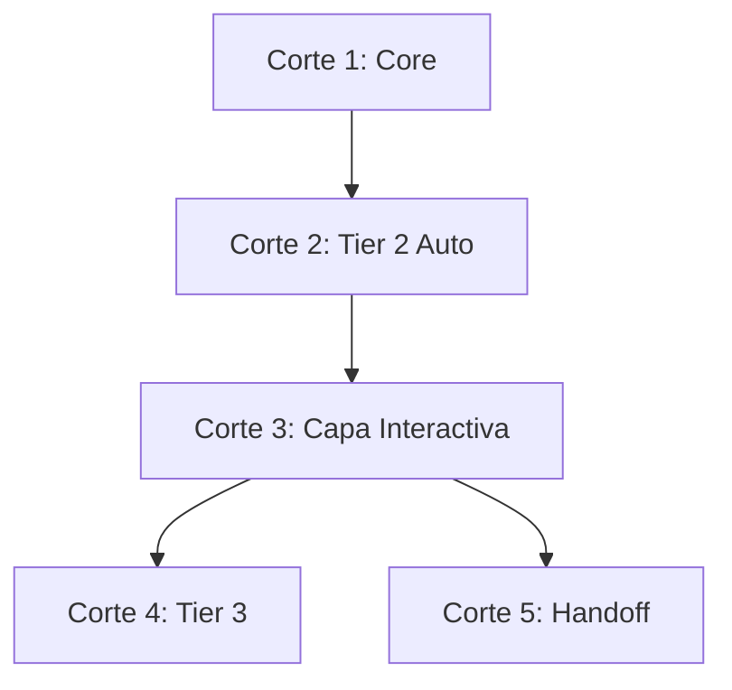

# Estrategia de Rollout y Entregables — Returns (Phase Contracts + Interactive Layer)

Para implementar los contratos de retorno y la capa interactiva definidos en `funky-interactive/` sin reventar el flujo existente, no podemos hacerlo todo de golpe. Necesitamos un orden secuencial basado en dependencias duras. Si metemos Handoff antes de tener el core del preflight andando, nos vamos a pisar.

Dividiremos el plan en **5 Cortes verticales** que entregan algo funcional en cada paso. Cada corte produce código que se puede probar y se puede mergear.

---

## 🗺️ Mapa de Dependencias y Ruta Crítica

Corte 3 es la bifurcación: una vez que el pipeline T2 en Auto funciona, podés agregar la capa interactiva (C3) y después Tier 3 (C4) o Handoff (C5) en cualquier orden. Pero C1 y C2 son obligatorios primero.

---

## 📦 Corte 1 — Core del Framework

*El esqueleto que todo lo demás necesita. Sin esto, ninguna fase puede comunicarse con el orquestador.*

**Qué se hace:**

1. **Envelope común:** Implementar el formato `status / summary / artifacts / next / risks` como estructura base que toda fase devuelve. Sin skill_resolution, sin detailed_report, sin Engram.
2. **Preflight:** Implementar el paso cero donde el orquestador analiza el pedido, recomienda valores (Tier, Docs, Release, Modo), y espera confirmación del humano después de `funky feature`.
3. **Cacheo de sesión:** Una vez confirmado el preflight, cachear `{tier, modo, release_type, docs_impact}` para toda la sesión. Determinar qué fases corren según el Tier.
4. **Esqueleto de routing de fases:** El orquestador sabe, para cada Tier, qué fases ejecutar y en qué orden. Tier 1 saltea explore/propose/spec/design/verify. Tier 2 corre explore ligero → propose ligero → spec ligero → tasks → apply → verify ligero → archive. Tier 3 corre explore SDD → propose → spec → design → tasks → apply → verify completo → archive.

**Criterio de Aceptación:** Un orquestador recibe un pedido "agrega login con Google", recomienda T3/Interactivo/Minor/NoDocs, el humano confirma, y el orquestador sabe qué fases va a ejecutar sin necesidad de preguntar de nuevo.

**Duración estimada:** 2-3 sesiones.

---

## 📦 Corte 2 — End-to-End Tier 2 en Automático

*El pipeline más chico que toca todas las fases. Valida que el circuito completo funciona sin fricción humana.*

**Qué se hace:**

1. **Explore Ligero (Sabueso):** Subagente de solo lectura que investiga y devuelve findings inline (qué, dónde, contexto). Sin artifact persistido.
2. **Propose Ligero:** Mini-delegación. Orquestador arma prompt con findings del Sabueso (si los hay) + template de `funky feature`. Sub-agente escribe `proposal.md` y devuelve return específico.
3. **Spec Ligero:** Mini-delegación. Sub-agente escribe delta specs en `specs/{domain}.md`. Solo happy paths + error principal.
4. **Tasks:** Workflow `funky-tasks` sobre template de `funky feature`. Desglose en fases + Review Workload Forecast.
5. **Apply:** Workflow `funky-worker`. Implementa tareas. Checkpoint pre-apply siempre (incluso en Auto). Si forecast >400, subdivisión automática en batches.
6. **Verify Ligero:** Workflow `funky-verify-ligero`. Build + tests + issues. Sin compliance matrix, sin design coherence.
7. **Archive:** Workflow `funky-archive`. Mueve artifacts a `archive/`, fusiona delta specs al source of truth.

**Reglas de modo Auto:**
- Sin pausas entre fases (excepto checkpoint pre-apply).
- Si forecast >400, subdivisión automática sin preguntar.
- Si blocked, frena y avisa.

**Criterio de Aceptación:** Completar un cambio T2 completo en Auto: el orquestador arranca, pasa por las 7 fases, y termina con el cambio archivado y los specs fusionados. Sin interacción humana excepto el preflight y el checkpoint pre-apply.

**Duración estimada:** 5-7 sesiones (es el corte más grande).

---

## 📦 Corte 3 — Capa Interactiva

*Agrega las pausas y presentaciones al humano entre fases. Solo aplica cuando el modo es Interactivo.*

**Qué se hace:**

1. **Templates de presentación:** Por cada fase, el orquestador muestra su template (`🔍 Explore complete`, `📄 Proposal ready`, `📋 Specs ready`, etc.) con la data relevante del envelope.
2. **Pregunta de cierre:** Después de cada fase, "¿Querés ajustar algo o continuamos?". Si el humano dice ajustar, el orquestador despierta al mismo sub-agente con feedback. Si dice continuar, mata al sub-agente y avanza.
3. **Review Workload Guard:** Cuando `funky-tasks` forecast >400 líneas, el orquestador pregunta "¿Dividimos en batches o lo dejamos en uno solo?" en vez de "¿ajustar o continuamos?".
4. **Archive:** No pregunta "ajustar", pregunta "¿Listo para arrancar otro cambio o necesitás algo más?".
5. **Manejo de blocked/risk:** Si una fase devuelve `Status: blocked`, el orquestador no pregunta — explica el bloqueo y frena. Si hay Risk Level High, lo marca con énfasis.

**Criterio de Aceptación:** Ejecutar el mismo cambio T2 del Corte 2 pero en modo Interactivo. El orquestador pausa después de cada fase, muestra el resultado, espera feedback, y avanza solo cuando el humano dice continuar.

**Duración estimada:** 2-3 sesiones (se apoya en el pipeline del Corte 2).

---

## 📦 Corte 4 — Tier 3

*Agrega las fases pesadas que solo corren en Tier 3. Design, Explore SDD completo, Verify completo.*

**Qué se hace:**

1. **Explore SDD (completo):** Workflow `funky-explore` con artifact persistido (`explore.md`). Approaches con pros/cons/effort, recomendación, ready-for-proposal.
2. **Propose completo:** Workflow `funky-propose` con envelope completo. Ya no es mini-delegación. Lee `explore.md` desde disco.
3. **Spec completo:** Workflow `funky-spec` con happiness + edge cases + error states completos.
4. **Design:** Workflow `funky-design`. Key decisions, files affected, testing strategy, open questions. Solo en Tier 3 — no existe flag, no existe versión ligera.
5. **Verify completo:** Workflow `funky-verify`. Compliance matrix vs specs, design coherence, NFR tracing (si aplica). Veredictos: PASS / PASS WITH FUNCTIONAL WARNINGS / PASS WITH COSMETIC WARNINGS / FAIL. Campo Acción explícito (archive, re-apply, fix inline, anotar).
6. **Apply con batches:** Si forecast >400, batches secuenciales con verify parcial opcional entre ellos.

**Criterio de Aceptación:** Completar un cambio T3 completo en Auto o Interactivo. El orquestador pasa por design, explore completo, verify completo. El verify report incluye compliance matrix y design coherence. Si hay functional warnings, dirige a re-apply.

**Duración estimada:** 4-5 sesiones.

---

## 📦 Corte 5 — Modo Handoff

*El puente al IDE. Permite que el humano ejecute fases en el IDE con copy-paste y vuelva con el Return Envelope.*

**Qué se hace:**

1. **Bloque copy-paste:** Cuando el modo es Handoff, el orquestador genera un bloque de texto listo para copiar al IDE, en vez de delegar directo a un sub-agente nativo.
2. **Ley de Invarianza:** El bloque copy-paste es **idéntico** al prompt que se enviaría a un sub-agente nativo en CLI. La única diferencia es el canal.
3. **Ciclo Handoff:** Orquestador prepara prompt → humano copia al IDE → sub-agente ejecuta → humano vuelve con el Return Envelope → orquestador continúa.
4. **Explore Ligero en Handoff:** El orquestador prepara prompt del Sabueso, humano corre en IDE, trae findings de vuelta. El orquestador los inyecta en el bloque del propose.

**Criterio de Aceptación:** Ejecutar un cambio T2 en Handoff completo. El orquestador prepara los bloques, el humano los corre en el IDE, vuelve con los envelopes, y el ciclo se completa sin que el orquestador tenga acceso directo a sub-agentes nativos.

**Duración estimada:** 2-3 sesiones (es más diseño de UX que lógica nueva — la lógica ya la tienen los cortes 2-4).

---

## ⚠️ Dependencias entre cortes

| Corte | Depende de | ¿Se puede hacer en paralelo? |
|-------|-----------|------------------------------|
| C1: Core | Nada | — |
| C2: T2 Auto | C1 | No |
| C3: Interactivo | C2 | No (necesita el pipeline andando) |
| C4: Tier 3 | C2 (parcial) | Sí con C3 (no comparten lógica) |
| C5: Handoff | C2 | Sí con C3 y C4 (canal independiente) |

C3 y C4 comparten dependencia en C2 pero no entre sí. Se pueden encarar en paralelo si hay dos personas o si querés alternar sesiones. C5 también puede arrancar después de C2 sin esperar a C3/C4.

---

## 📊 Resumen de esfuerzo

| Corte | Sesiones | ¿Qué entrega? |
|-------|----------|---------------|
| C1 | 2-3 | Esqueleto: envelope, preflight, routing de fases |
| C2 | 5-7 | Pipeline T2 completo en Auto |
| C3 | 2-3 | Pausas, presentaciones, Review Workload Guard |
| C4 | 4-5 | Design, explore SDD, verify completo, batching |
| C5 | 2-3 | Bloques copy-paste, Ley de Invarianza, ciclo Handoff |
| **Total** | **~18 sesiones** | Framework completo |

---

## ⚠️ Factores de Éxito

1. **No mezclar modos en el mismo cambio:** Si el primer corte implementa Auto, no intentes que también maneje Interactivo. Cada corte resuelve un problema a la vez.
2. **El checkpoint pre-apply es la única pausa obligatoria en Auto:** No inventes más pausas. En Auto, el humano ya delegó confianza. Si querés más control, usá Interactivo.
3. **Los docs ya están definidos en `funky-interactive/`:** No rediseñes durante la implementación. Si algo no cierra, se actualiza el doc primero, después el código.
4. **Cada corte debe mergearse a main:** No acumules ramas largas. Un corte = una rama = un PR (o merge directo si es chico).
