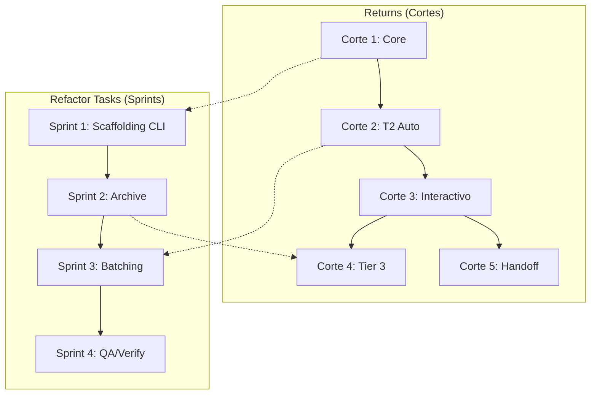

# Estrategia Coordinada — Refactor Tasks + Returns

> **Propósito:** Coordinar dos features acopladas sin mezclar sus roadmaps. Cada feature mantiene su propio ritmo pero comparte dependencias.
>
> **Docs de referencia:**
> - `refactor-tasks/estrategia-features.md` — Sprint plan del refactor de tasks y tiers
> - `.importantes/estrategia-entregables-returns.md` — Cortes verticales de returns (envelope, preflight, capa interactiva)

---

## Las Dos Features

| Feature | Qué resuelve | Ritmo | Roadmap |
|---------|-------------|-------|---------|
| **Refactor Tasks** | Fragmentación de templates, batching, archive, verify | 4 sprints semanales | `estrategia-features.md` |
| **Returns** | Envelope, preflight, routing de fases, capa interactiva, handoff | 5 cortes verticales | `estrategia-entregables-returns.md` |

---

## Mapa de Dependencias



### Dependencias Duras

| Si arrancás... | Necesitás que esté listo... | Por qué |
|----------------|---------------------------|---------|
| **Returns Corte 1** (Core) | Nada | Es el esqueleto base |
| **Refactor Sprint 1** (Scaffolding) | Returns Corte 1 (Core) | Los 3 Inquirers y el preflight viven en el Core |
| **Returns Corte 2** (T2 Auto) | Refactor Sprint 1 (Scaffolding) | Necesita los templates fragmentados y el contrato E1 |
| **Refactor Sprint 2** (Archive) | Returns Corte 2 (T2 Auto) | Archive necesita el pipeline T2 funcionando |
| **Returns Corte 3** (Interactivo) | Returns Corte 2 (T2 Auto) | Las pausas se apoyan en el pipeline andando |
| **Refactor Sprint 3** (Batching) | Returns Corte 2 + checkpoint pre-apply | Batching necesita el checkpoint para cada batch |
| **Returns Corte 4** (Tier 3) | Refactor Sprint 2 (Archive) + Returns Corte 2 | Tier 3 necesita archive y el pipeline base |
| **Returns Corte 5** (Handoff) | Returns Corte 2 | Canal independiente, puede arrancar después de C2 |

### Dependencias Blandas (cross-references)

| Sprint/ Corte | Referencia cruzada | Qué comparten |
|---------------|-------------------|---------------|
| Sprint 1 ↔ Corte 1 | Preflight, Inquirers, routing de fases | Definición del paso cero |
| Sprint 3 ↔ Corte 2 | Checkpoint pre-apply, batching | Mismo guardrail, diferente contexto |
| Sprint 2 ↔ Corte 4 | Archive, verify completo | Mismo workflow, diferente profundidad |
| Sprint 4 ↔ Corte 3 | Presentación de resultados, Review Workload Guard | Mismo template de presentación |

---

## Timeline Unificada (Sugerida)

```text
Sesión 1-3:   Returns Corte 1 (Core) ─────────────────────┐
Sesión 3-5:   Refactor Sprint 1 (Scaffolding) ────────────┤
Sesión 5-10:  Returns Corte 2 (T2 Auto) ──────────────────┤
Sesión 8-12:  Refactor Sprint 2 (Archive) ────────────────┤
Sesión 10-13: Returns Corte 3 (Interactivo) ──────────────┤
Sesión 12-16: Refactor Sprint 3 (Batching) ───────────────┤
Sesión 14-19: Returns Corte 4 (Tier 3) ───────────────────┤
Sesión 16-20: Refactor Sprint 4 (QA/Verify) ──────────────┤
Sesión 18-21: Returns Corte 5 (Handoff) ──────────────────┘
```

**Nota:** Hay solapamiento intencional. Los sprints y cortes no son bloqueantes entre sí — comparten dependencias blandas que se resuelven con cross-references, no con bloqueos duros.

---

## Reglas de Coordinación

1. **Un doc por feature.** Cada roadmap vive en su archivo. Este doc solo coordina, no reemplaza.
2. **Cross-references obligatorias.** Cuando un sprint/corte toca algo que ya definió la otra feature, referenciar el doc correspondiente.
3. **No duplicar decisiones.** Si el checkpoint pre-apply está definido en `spec-cli-ide-boundaries.md`, no redefinirlo en los roadmaps — solo referenciarlo.
4. **Merge independiente.** Cada feature puede mergearse por separado. No crear un mega-PR que junte las dos.
5. **Engram como bridge.** Si una feature descubre algo que afecta a la otra, guardarlo en engram con un topic_key compartido (ej. `sdd/refactor-tasks/coordination`).

---

## ⚠️ Riesgos de Coordinación

| Riesgo | Mitigación |
|--------|-----------|
| Solapamiento en preflight/Inquirers | Sprint 1 y Corte 1 definen lo mismo → consolidar la definición en `spec-cli-ide-boundaries.md` y referenciar desde ambos roadmaps |
| Checkpoint pre-apply definido en dos lugares | Mantener la fuente de verdad en `spec-cli-ide-boundaries.md §Modos de Ejecución` |
| Batch logic duplicada entre sprint 3 y corte 2 | El corte 2 define el "qué" (auto subdivisión), el sprint 3 define el "cómo" (heurística de batches) |
| Archive flow confuso entre sprint 2 y corte 4 | Sprint 2 implementa archive básico, corte 4 agrega compliance matrix y NFR tracing |
