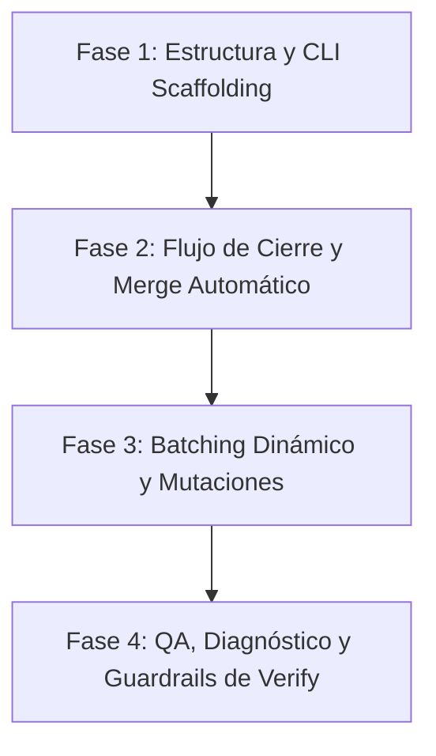

# Estrategia de Rollout y Entregables — Refactor Tasks

Para implementar esta refactorización masiva del ciclo de vida de tareas y subagentes sin romper el changarro en producción, no podemos tirar código a lo loco. Necesitamos un orden secuencial estricto basado en dependencias duras. Si metemos batching dinámico antes de fragmentar el monolito de templates, nos vamos a dar un tiro en el pie, wey.

Dividiremos el plan en **4 Sprints (de 1 semana cada uno)** para entregar un sistema estable, probado y listo en 1 mes.

---

## 🗺️ Mapa de Dependencias y Ruta Crítica

---

## 📅 Entregables por Semana

### 🚀 Semana 1 — Fase 1: Fragmentación del Monolito y Scaffolding CLI
*El objetivo es cambiar las bases físicas del sistema y los contratos de inyección.*
* **Qué se hace:**
  1. Modificar el comando `funky feature` en el CLI para ejecutar los 3 Inquirers (Tier, Docs Core, SemVer Release).
  2. Implementar la inyección fragmentada de templates: `tasks.md`, `docs.md` (condicional) y `release.md` (condicional).
   3. Establecer el Contrato E1 de delegación en los prompts del Orquestador y deprecación de `artifact_state` y `has_design` (Tier 3 = design siempre).
* **Criterio de Aceptación:** Ejecutar `funky feature` genera la estructura de carpetas correcta según el Tier y las respuestas del desarrollador, sin inyectar archivos dummy vacíos.

### 🔄 Semana 2 — Fase 2: Ciclo de Cierre Determinista y `/funky-archive`
*Una vez fragmentado el monolito, implementamos el flujo de salida y el conserje único de especificaciones.*
* **Qué se hace:**
  1. Modificar `/funky-archive` para que actúe como único responsable de mover el change folder y hacer merge de specs (specs delta en Tier 2 y 3).
  2. Implementar el control condicional en `/funky-archive`: si no hay reporte de verificación (Tier 2), omitir verificación y mergear specs.
  3. Implementar en el Orquestador la ejecución *inline* de `docs.md` y `release.md` al cierre de la feature.
* **Criterio de Aceptación:** Completar una feature Tier 2 limpia el repositorio, archiva el change folder en su destino histórico y consolida el root spec sin intervenciones del motor de testing.

### 📦 Semana 3 — Fase 3: Batching Secuencial y Mutación de Tiers
*Con el flujo de cierre resuelto, optimizamos la ejecución de código para mitigar el Context Decay.*
* **Qué se hace:**
  1. Adaptar `/funky-tasks` para calcular el PR budget y generar las tareas a partir de la Fase 1 de forma adaptativa.
  2. Implementar la heurística de batches en el Orquestador (Tiers 1/2 en mínimo 2 batches: Batch A código, Batch B cierre/merge).
   3. Codificar las reglas de Mutación de Tier a medio vuelo (de T1 a T2 reiniciando desde explore; de T2 a T3 solo en riesgo CRITICAL, con aprobación humana explícita — ver §1.4 de `spec-routing-tiers.md`).
   4. Agregar el guardrail de Worker Reactivo: si el contexto se satura, commit parcial, escribe `report.md` y se detiene.
   5. Implementar el checkpoint pre-apply: antes de cada batch, el orquestador presenta el plan y el humano elige dónde ejecutar (CLI o IDE). Ver §Modos de Ejecución en `spec-cli-ide-boundaries.md`.
* **Criterio de Aceptación:** Una feature Tier 2 con más de 5 archivos en el PR budget se divide de manera transparente en batches manejables y permite escalar a Tier 3 en caliente de forma limpia.

### 🧪 Semana 4 — Fase 4: Quality Assurance e Inteligencia de Diagnóstico
*La última línea de defensa: mover los tests al cierre del código y dar herramientas de diagnóstico al Orquestador.*
* **Qué se hace:**
  1. Mover la fase de testing obligatorio al final del template de `tasks.md` para todos los Tiers.
  2. Implementar la política estricta de NO-FIX ciego: el worker no puede reintentar fixes a ciegas si fallan los tests.
  3. Configurar al Sabueso (`research` - Explore Ligero) como subagente de diagnóstico rápido que entrega el stack trace digerido al Orquestador.
  4. Incorporar la matriz de severidades post-verify (Critical, Warning, Suggestion) en el validador.
* **Criterio de Aceptación:** Si un test falla en el worker, el flujo se frena, se invoca un Sabueso que genera el diagnóstico en un `report.md` de 10 líneas, y el Orquestador puede decidir de manera informada el curso de acción.

---

## ⚠️ Factores de Éxito e Instrucciones para el Próximo Agente
1. **No seas codo con el Engram:** Cada vez que encuentres un fallo en el cálculo de PR Budget o un edge case en la mutación de Tiers, regístralo al momento usando `funky engram add`.

