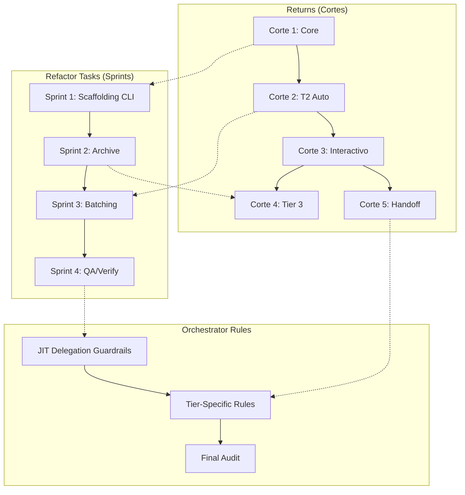

# Estrategia Coordinada — Plan Maestro

> **Propósito:** Coordinar todas las features acopladas del refactor SDD.
> Cada feature mantiene su propio ritmo pero comparte dependencias.
>
> **Docs de referencia:**
> - `refactor-tasks/estrategia-features.md` — Sprint plan del refactor de tasks y tiers
> - `.importantes/estrategia-entregables-returns.md` — Cortes verticales de returns
> - `refactor-tasks/spec-orchestrator-rules.md` — Reglas del orquestador (pendiente completar)

---

## Las Tres Features

| Feature | Qué resuelve | Ritmo | Roadmap |
|---------|-------------|-------|---------|
| **Refactor Tasks** | Fragmentación de templates, batching, archive, verify | 4 sprints semanales | `estrategia-features.md` |
| **Returns** | Envelope, preflight, routing de fases, capa interactiva, handoff | 5 cortes verticales | `estrategia-entregables-returns.md` |
| **Orchestrator Rules** | Reglas JIT, delegation guardrails, tier-specific rules | Fase final | Este doc (§Fase Final) |

---

## Mapa de Dependencias



### Dependencias Duras

| Si arrancás... | Necesitás que esté listo... | Por qué |
|----------------|---------------------------|---------|
| **Returns Corte 1** (Core) | Nada | Es el esqueleto base |
| **Refactor Sprint 1** (Scaffolding) | Returns Corte 1 (Core) | Los 3 Inquirers y el preflight viven en el Core |
| **Returns Corte 2** (T2 Auto) | Refactor Sprint 1 (Scaffolding) | Necesita los templates fragmentados y el contrato E1 |
| **Refactor Sprint 2** (Archive) | Returns Corte 2 (T2 Auto) | Archive necesita el pipeline T2 funcionando |
| **Returns Corte 3** (Interactivo) | Returns Corte 2 (T2 Auto) | Las pausas se apoyan en el pipeline andando |
| **Refactor Sprint 3** (Batching) | Returns Corte 2 + checkpoint pre-apply | Batching necesita el checkpoint para cada batch |
| **Returns Corte 4** (Tier 3) | Refactor Sprint 2 (Archive) + Returns Corte 2 | Tier 3 necesita archive y el pipeline base |
| **Returns Corte 5** (Handoff) | Returns Corte 2 | Canal independiente, puede arrancar después de C2 |
| **Orchestrator Rules** (Fase Final) | Todos los sprints + cortes completados | Las rules documentan lo que ya existe, no lo que se va a crear |

### Dependencias Blandas (cross-references)

| Sprint/Corte | Referencia cruzada | Qué comparten |
|---------------|-------------------|---------------|
| Sprint 1 ↔ Corte 1 | Preflight, Inquirers, routing de fases | Definición del paso cero |
| Sprint 3 ↔ Corte 2 | Checkpoint pre-apply, batching | Mismo guardrail, diferente contexto |
| Sprint 2 ↔ Corte 4 | Archive, verify completo | Mismo workflow, diferente profundidad |
| Sprint 4 ↔ Corte 3 | Presentación de resultados, Review Workload Guard | Mismo template de presentación |

---

## Timeline Unificada

```text
Sesión 1-3:   Returns Corte 1 (Core) ─────────────────────┐
Sesión 3-5:   Refactor Sprint 1 (Scaffolding) ────────────┤
Sesión 5-10:  Returns Corte 2 (T2 Auto) ──────────────────┤
Sesión 8-12:  Refactor Sprint 2 (Archive) ────────────────┤
Sesión 10-13: Returns Corte 3 (Interactivo) ──────────────┤
Sesión 12-16: Refactor Sprint 3 (Batching) ───────────────┤
Sesión 14-19: Returns Corte 4 (Tier 3) ───────────────────┤
Sesión 16-20: Refactor Sprint 4 (QA/Verify) ──────────────┤
Sesión 18-21: Returns Corte 5 (Handoff) ──────────────────┤
Sesión 21-23: Orchestrator Rules (Fase Final) ────────────┘
```

---

## Fase Final: Orchestrator Rules al 100%

**Objetivo:** Que `spec-orchestrator-rules.md` cubra todos los puntos operativos del orquestador, sin drafts pendientes.

### Estado actual de las rules

| § | Sección | Estado | Gap |
|---|---------|--------|-----|
| §1 | Identidad del Orquestador | ✅ Completo | — |
| §2 | Guardrails de Edición (JIT) | ⚠️ Draft | Falta decidir separación final |
| §3 | Razonamiento Pre-Vuelo | ✅ Completo | — |
| §4 | Memory Polling | ✅ Completo | — |
| §5 | Orchestration Checklist | ⚠️ Pendiente | Absorbido por JIT, falta crear `jit-delegation-guardrails` |
| §6 | Message Passing / Handoff | ✅ Completo | — |
| §7 | Phase Batching | ✅ Completo | — |
| §8 | Persistencia / Session Close | ✅ Completo | — |
| — | Notas: JIT por Tier | ⚠️ Draft | No está como rule, solo como nota |
| — | Notas: Tier 0 ideation | ⚠️ Draft | No está como rule |
| — | Notas: Escalado mid-SDD | ⚠️ Draft | No está como rule |

### Tareas de la Fase Final

#### T1: Cerrar §2 — Guardrails JIT

**Decisión pendiente:** Cómo separar las rules JIT de las rules permanentes.

**Propuesta:**
- `spec-orchestrator-rules.md` = rules **siempre activas** (§1, §3, §4, §6, §7, §8)
- `jit-delegation-guardrails.md` = rules que se activan **justo antes de delegar** (§2 + §5)
- `jit-tier-routing.md` = rules de routing por Tier (las notas del final como rule formal)

**Criterio de aceptación:** §2 ya no dice "draft". Las rules JIT están en archivos separados y referenciados desde el spec principal.

#### T2: Crear `jit-delegation-guardrails.md`

**Contenido (ya acordado en §5 actual):**
1. ¿El CLI ya inyectó scaffolding (`funky feature <name>`)? Si no → FRENAR.
2. ¿Ya ejecuté Memory Polling? Si no → ejecutar ahora.
3. `funky feature` es intervención humana explícita. El orquestador solo recomienda.

**Formato:** Archivo separado, referenciado desde `spec-orchestrator-rules.md` §2.

#### T3: Promover Notas a Rules

Las tres notas del final del spec actual deben convertirse en rules formales:

| Nota actual | Nueva rule | Contenido |
|-------------|-----------|-----------|
| JIT por Tier | `jit-tier-routing.md` | Para cada Tier, qué fases corren y qué workflows se usan. Reference a `funky-inputs.md` y `tier2-delegation-rules.md`. |
| Tier 0 ideation | §9 en spec principal | Regla: Tier 0 es ideación pura. Si hay features concretas, redactar RFC. En sesión nueva, pre-vuelo con Tier correcto. |
| Escalado mid-SDD | §10 en spec principal | Regla: Escalar de T1→T2 reiniciando desde explore. Escalar de T2→T3 solo en riesgo CRITICAL con aprobación humana. Prohibido escalar de T0 a cualquier Tier en la misma sesión. |

#### T4: Audit Final

**Checklist de cobertura:**

- [ ] §1 Identidad — ¿cubre todas las prohibiciones?
- [ ] §2 JIT — ¿está como rule separada, no como draft?
- [ ] §3 Pre-vuelo — ¿incluye la Escalation Matrix completa?
- [ ] §4 Memory Polling — ¿cubre Engram y ORCHESTRATOR-STATE?
- [ ] §5 Delegation guardrails — ¿existe como archivo separado?
- [ ] §6 Handoff — ¿cubre Ley de Invarianza y bloques copy-paste?
- [ ] §7 Batching — ¿cubre T1/T2 (2 batches) y T3 (secuencial)?
- [ ] §8 Session Close — ¿cubre Engram trigger y ORCHESTRATOR-STATE?
- [ ] §9 Tier 0 — ¿está como rule formal?
- [ ] §10 Escalado — ¿cubre todas las mutaciones de Tier?
- [ ] Cross-references — ¿todos los specs referencian los docs correctos?
- [ ] Sin drafts — ¿ninguna sección dice "draft" o "pendiente"?

**Criterio de aceptación:** El audit devuelve 0 gaps. El spec está listo para implementación.

---

## Reglas de Coordinación

1. **Un doc por feature.** Cada roadmap vive en su archivo. Este doc solo coordina, no reemplaza.
2. **Cross-references obligatorias.** Cuando un sprint/corte toca algo que ya definió la otra feature, referenciar el doc correspondiente.
3. **No duplicar decisiones.** Si el checkpoint pre-apply está definido en `spec-cli-ide-boundaries.md`, no redefinirlo en los roadmaps — solo referenciarlo.
4. **Merge independiente.** Cada feature puede mergearse por separado. No crear un mega-PR que junte las dos.
5. **Engram como bridge.** Si una feature descubre algo que afecta a la otra, guardarlo en engram con un topic_key compartido (ej. `sdd/refactor-tasks/coordination`).
6. **Orchestrator rules es la fase final.** Las rules documentan lo que ya existe. No se crean rules para features que aún no se implementan.

---

## ⚠️ Riesgos de Coordinación

| Riesgo | Mitigación |
|--------|-----------|
| Solapamiento en preflight/Inquirers | Sprint 1 y Corte 1 definen lo mismo → consolidar en `spec-cli-ide-boundaries.md` |
| Checkpoint pre-apply definido en dos lugares | Fuente de verdad en `spec-cli-ide-boundaries.md §Modos de Ejecución` |
| Batch logic duplicada entre sprint 3 y corte 2 | Corte 2 define el "qué", sprint 3 define el "cómo" |
| Archive flow confuso entre sprint 2 y corte 4 | Sprint 2 implementa archive básico, corte 4 agrega compliance matrix |
| Orchestrator rules incompletas | Fase final (T1-T4) cierra todos los drafts antes de implementación |

---

## 📊 Resumen de esfuerzo total

| Feature | Sesiones | Qué entrega |
|---------|----------|-------------|
| Returns (5 cortes) | ~18 | Framework completo de returns + capa interactiva |
| Refactor Tasks (4 sprints) | ~16 | Templates fragmentados, batching, archive, QA |
| Orchestrator Rules (fase final) | ~3 | Rules al 100%, sin drafts |
| **Total** | **~37 sesiones** | **SDD completo y auditable** |
